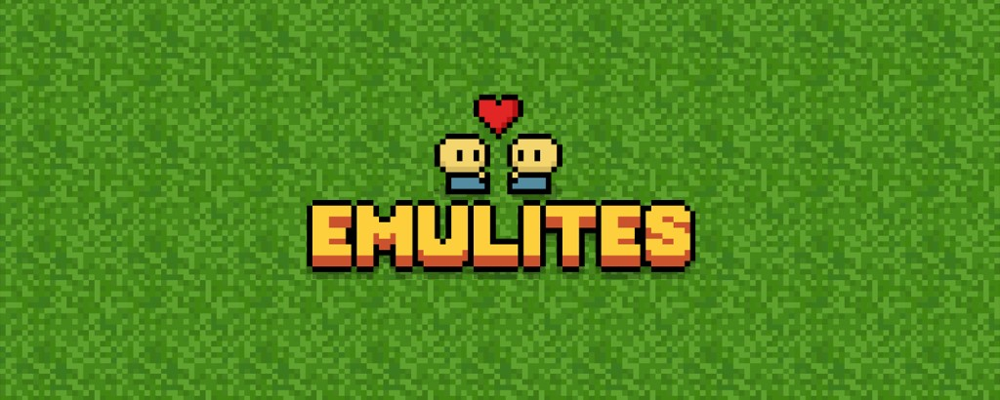

<p align="center">
  
</p>

<p align="center">
  <strong>A tiny isometric pixel world you build in the browser.</strong><br />
  <em>Built on Solana.</em>
</p>

<p align="center">
  Name your Emulite · pick an outfit · shape a town · save your world
</p>

<p align="center">
  <a href="https://github.com/dflores112/emulites">GitHub</a>
  ·
  <a href="https://emulites.netlify.app">Play</a>
  ·
  Solana
  ·
  Phaser 3
</p>

---

## Why Emulites

Emulites is a cozy browser builder: an isometric map with a plaza, farm, church, market stalls, wandering NPCs, and little animals. You enter as your own Emulite, place tiles from a hotbar, and your character + builds stick around in local save.

**Built on Solana** — the playable world runs in the browser; the Emulite mint on Solana is the on-chain home for the project (copy it from the in-game About banner).

No accounts. No install beyond Node. Open it, play, build.

---

## Quick start

```bash
git clone https://github.com/dflores112/emulites.git
cd emulites
npm install
npm run dev
```

Then open the URL Vite prints (usually `http://127.0.0.1:5173`).

| Script | Purpose |
| --- | --- |
| `npm run dev` | Local development |
| `npm run build` | Typecheck + production build → `dist/` |
| `npm run preview` | Preview the production build |

Ships with a Netlify config (`netlify.toml`) that builds with Node 22 and publishes `dist`.

---

## Features

| | |
| --- | --- |
| **Create** | Name your Emulite and choose from **12 outfits** — denim, crimson, moss, violet, plus caps, beanies, top hat, crown, wizard, flower, and bandana |
| **World** | Large isometric map: grass, paths, plaza, water, trees, farms, barn, church steeple, wells, market stalls |
| **Cities** | Four gridded cities — streets, sidewalks, lane paint, crosswalks, traffic, and skylines up to 13 tiles tall with setbacks, water towers and antennas |
| **Theme parks** | Thrill City has two coasters, a Ferris wheel and drop tower; Splash Bay has winding water slides, racing chutes, pools and a lazy river |
| **Town life** | Named NPCs in mixed outfits, chickens / rabbits / frogs, and a side-panel town chat |
| **Build** | Hotbar placeables — floors, walls, doors, furniture, crops, fences, scenery — with ghost preview |
| **Camera** | Scroll zoom, drag-to-pan, recenter |
| **Save** | Autosave character + placed tiles in `localStorage`; continue on reload |
| **About** | Top announcement banner → About page with a **copyable Solana mint address** |

---

## Controls

| Input | Action |
| --- | --- |
| `W` `A` `S` `D` / arrows | Move |
| Mouse wheel | Zoom |
| `C` | Recenter on you |
| Hotbar / keys on icons | Select placeable |
| Left click | Place |
| Right click | Remove |
| `H` or **Drag** mode | Pan the map |
| **New Game** (bottom left) | Wipe save → Enter World screen |

---

## Project structure

```
src/
  data/        Outfits, build catalog, About + contract copy
  scenes/      Create scene · World scene
  systems/     Iso grid, world gen, build, NPCs, animals, save, textures
  ui/          Create UI, HUD, chat, announce/About, styles
public/        Pixel sprite assets + favicon
```

Tune the banner text and Emulite Solana mint address in:

```
src/data/site.ts
```

---

## Stack

- **[Phaser](https://phaser.io/) 3.88.2** — isometric world, sprites, input
- **[Vite](https://vitejs.dev/)** + **TypeScript** — fast local loop and Netlify-ready build
- **DOM UI** — create screen, HUD, chat, and About overlay

---

## Contributing / deploying

1. Fork or clone
2. `npm install` → `npm run dev`
3. Ship with `npm run build` (or connect the repo to Netlify)

Ideas welcome: more outfits, new placeables, better NPC routines, multiplayer later.

---

<p align="center">
  <sub>Built for little worlds.</sub>
</p>
